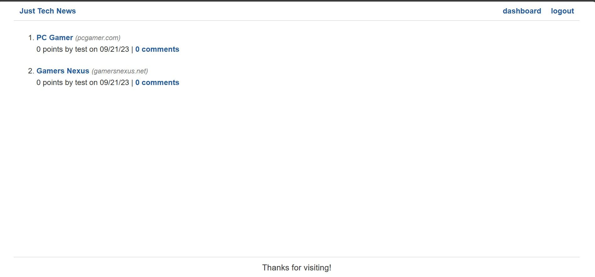

# Python Newsfeed

  # Description
  
  A tech news blog API built on Python backend with Flask. This project is mainly
focused on building the back-end and API to handle CRUD requests using Python. You
create an account to post links to various tech sites for which people can make comments
on the post made, all posts appear on the homepage. This project uses MySQL for the
database and Jinja2 HTML templating for the front-end. 

  # Table of Contents
  
  - [Installation](#installation)
  - [Usage](#usage)
  
  - [Deployed App](#deployed-app)
  - [Tests](#tests)
  - [Questions](#questions)

  # Installation
  
  Python v3.9+ 
  Database: MySQL.
  Front-end Frameworks and Dependencies:  
  - Jinja2

  Back-end Frameworks and Dependencies:  
  - BCrypt
  - Flask
  - gunicorn
  - PyMySQL
  - SQLAlchemy

  # Usage
  
    

  # Deployed App  

  This app is deployed on Render: https://python-newsfeed-x3es.onrender.com/

  # Tests
    
    None written.

  # Questions
  
  You can find my GitHub profile at: https://github.com/r134x7

  If you have any questions, you can contact me by email: r134x7@gmx.com

